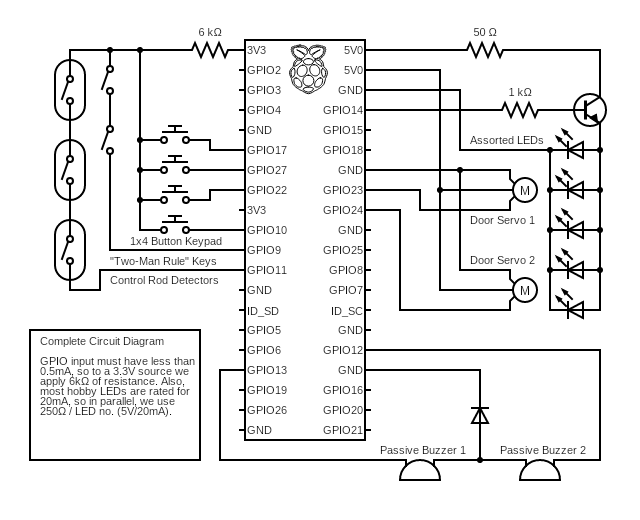

# RPi-based Escape Room
This a college project.

## Operation
Press `Ctrl+D` to reset, and `Ctrl+C` to exit.

## Parts List
- 1 x [Raspberry Pi 4B](https://www.raspberrypi.com/products/raspberry-pi-4-model-b/)
- 1 x 1x4 keypad, such as the [Adafruit 1332](https://www.adafruit.com/product/1332)
- 2 x 5v Micro servo
- 2 x Passive Buzzer (Piezo)

## Circuit Diagram

Note: Diagram may not fully reflect layout of final design. All pin numbers can be changed in `config.py` (see below).

## Pin Configuration
Configurable in `config.py`, here are the default values:

|             | |        HEADER | PIN | DIAGRAM         | |             |
|:------------|-|--------------:|:---:|:----------------|-|------------:|
|             | |         `3V3` |     | `5V`            | | servo power |
|             | |     `2 (SDA)` |     | `5V`            | |             |
|             | |     `3 (SCL)` |     | `GND`           | | servo gnd   |
|             | |  `4 (GPCLK0)` |     | `14 (TXD)`      | |             |
|             | |         `GND` |     | `15 (RXD)`      | |             |
| combo btn 1 | |          `17` |     | `18 (PCM_CLK)`  | |             |
| combo btn 2 | |          `27` |     | `GND`           | |             |
| combo btn 3 | |          `22` |     | `23`            | | servo 1     |
| combo power | |         `3V3` |     | `24`            | | servo 2     |
| combo btn 4 | |   `10 (MOSI)` |     | `GND`           | |             |
|             | |    `9 (MISO)` |     | `25`            | |             |
|             | |   `11 (SCLK)` |     | `8 (CE0)`       | |             |
|             | |         `GND` |     | `7 (CE1)`       | |             |
|             | |   `0 (ID_SD)` |     | `1 (ID_SC)`     | |             |
|             | |           `5` |     | `GND`           | |             |
|             | |           `6` |     | `12 (PWM0)`     | | piezo 1     |
| piezo 2     | |   `13 (PWM1)` |     | `GND`           | |             |
|             | | `19 (PCM_FS)` |     | `16`            | |             |
|             | |          `26` |     | `20 (PCM_DIN)`  | |             |
| piezo gnd   | |         `GND` |     | `21 (PCM_DOUT)` | |             |

## Credits
- [metachris](https://github.com/metachris), author of the [RPIO](https://github.com/metachris/RPIO) library
- [Circuit Diagram](https://www.circuit-diargam.org), for generation of circuit diagrams
- [StackOverflow](https://stackoverflow.com/) Users et al

---
© 2023 Antithesise